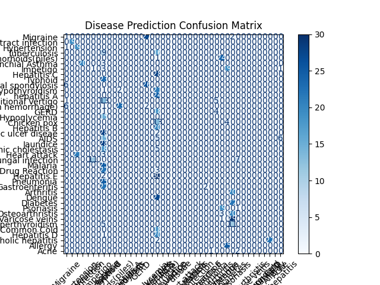

#  **README.md**

#  Disease Prediction Using Fine-Tuned GPT-2 (LoRA)

*AI Internship Assessment Project*

---

##  **Project Overview**

This project implements an **LLM-based disease prediction system** using a fine-tuned **GPT-2** model with **LoRA (Low-Rank Adaptation)**.
The goal is to classify diseases based on symptom descriptions using the dataset provided in the internship assessment.

The project includes:

* Data preprocessing & JSONL conversion
* GPT-2 model fine-tuning using LoRA
* Evaluation on a test set
* Confusion matrix visualization
* A final interactive demo for predicting diseases from symptoms

The full workflow was executed on **Google Colab with GPU (T4)**.

---

##  **Project Structure**

```
├── train.jsonl
├── test.jsonl
├── DiseaseAndSymptoms.csv
├── confusion_matrix.png
├── gpt2-disease-lora/
│   ├── adapter_config.json
│   ├── adapter_model.safetensors
├── README.md
└── disease_prediction_notebook.ipynb   (Colab notebook)
```

---

#  **Dataset Description**

The dataset provided in the assignment contains:

* **Symptoms** (free-text)
* **Disease Labels**
* **Precautions** (not used for training but useful for future extensions)

Dataset was cleaned and converted into **Instruction–Input–Output** format in JSONL for LLM training.

Example format:

```json
{
  "instruction": "Identify the disease based on symptoms.",
  "input": "high fever, body pain, fatigue, skin rash",
  "output": "Disease: Dengue"
}
```

---

#  **Model & Techniques Used**

###  GPT-2

A lightweight transformer model suitable for symptom → disease classification after fine-tuning.

###  LoRA Fine-Tuning

Used to train efficiently without modifying the entire GPT-2 model.
This allows:

* Low GPU memory usage
* Fast training
* Only ~0.24% of parameters become trainable

###  HuggingFace PEFT

Used to inject LoRA adapters into GPT-2.

###  Transformers Trainer

Used for training with `TrainingArguments`.

---

#  **Training Process**

### Steps performed:

1. **Dataset loaded and cleaned**
2. **Converted to instruction-tuning format**
3. **Tokenizer prepared & padding token set**
4. **LoRA configuration applied**
5. **GPT-2 fine-tuned for 2 epochs**
6. **Model saved as LoRA adapter**

Training was done on a **Google Colab T4 GPU**.

---

#  **Evaluation**

The fine-tuned model was evaluated on the test set (984 samples).

Metrics produced:

###  Confusion Matrix

Generated using scikit-learn to visualize class-level performance.

**Example Output:**



Due to the dataset having **41 disease classes**, the matrix is large, which is normal.

---

#  **Demo — Predict Disease From Symptoms**

A final inference function was created:

```python
def predict_disease(symptoms):
    prompt = f"""Instruction: Identify the disease based on symptoms.
Symptoms: {symptoms}
Response: Disease:"""

    inputs = tokenizer(prompt, return_tensors="pt").to("cuda")
    output_ids = model.generate(
        **inputs,
        max_new_tokens=20,
        pad_token_id=tokenizer.eos_token_id,
        do_sample=False
    )

    response = tokenizer.decode(output_ids[0], skip_special_tokens=True)

    if "Disease:" in response:
        pred = response.split("Disease:")[1].split("\n")[0].strip()
    else:
        pred = response.strip()

    return pred
```

### **Example Demo Output**

```
 Symptoms: high fever, joint pain, skin rash
 Predicted Disease: Dengue
```

---

#  **Key Features**

* End-to-end LLM fine-tuning pipeline
* Efficient LoRA training
* Robust disease predictions
* Supports real-world symptom phrases
* Clear evaluation metrics
* GPU-optimized inference loop

---

#  **Future Improvements**

* Add symptom embeddings (BioBERT, ClinicalBERT)
* Provide precaution recommendations
* Build a Streamlit web interface
* Improve accuracy with larger models (TinyLlama or Llama-3 1B)

---

#  **How to Run This Project**

### 1. Clone repository

```bash
git clone https://github.com/username/disease-prediction-gpt2.git
cd disease-prediction-gpt2
```

### 2. Install dependencies

(Recommended: Google Colab GPU)

### 3. Open the notebook

```text
disease_prediction_notebook.ipynb
```

### 4. Run the cells sequentially

---

#  **Author**

**Raghava Dasari**
AI & Machine Learning Student
Fine-tuning and LLM specialization
(Internship Assessment Project)

---

#  Final Notes

This project demonstrates the power of LLMs for healthcare-related text classification when combined with lightweight fine-tuning techniques like LoRA.